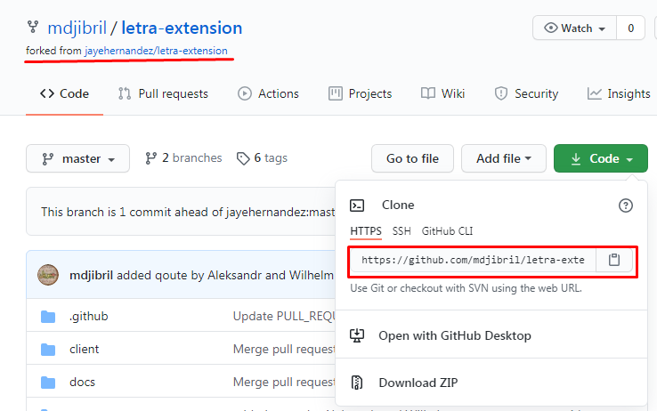

# 🗒 What the Fork? (Contributing Guidelines)

> A simple guide on how to contribute to this project, from start to end! Also did you get the pun? I love The Good Place.

Is this your first time contributing to open source? No worries, here's a simple guide to help you out! If you get stuck on a step, please don't hesitate to ask me. :)

You can contribute in two ways, whichever is more convinient for you:
1. Via Github Website _(no need to download anything!)_
2. Via Local Machine

## 1️⃣ Via Github Website
1. Check the **Issues page** to choose what you want to contribute on!

2. Click on **Fork** on the upper right hand of the screen.

> ☁️ Forking a Repository allows you to have your own copy of the repository. This is the best practice for contributing to open source projects.

3. Once the repo is forked, you'll be redirected to the newly created repository. You should see **forked from jayehernandez / letra-extension**.

4. You can now make changes to this repository, depending on what issues you chose to take on. 👩🏻‍💻👨🏻‍💻

5. When you're finished with the changes, you'll see that your repository is ahead of some commits from the main repository. Click on **Pull Request** to start creating a pull request (PR).

> ☁️ Pull Requests allow maintainers of a project to review your code and merge it to the main repository afterwards.

6. You'll be able to choose which branch you'd like to compare with. Make sure you choose the **master** branch. After this, you can click on **Create pull request**.

7. You'll be able to edit the title and description of your pull request before actually creating the pull request. If you are referencing an open issue, please reference it here. 

> ☁️ Reference an issue: Typing out the pound sign (#) will search through issues and PRs in the repository. You can write something like: "This PR references #14" and it will automatically be linked to issue number 14!

8. Hooray! You successfully created a PR for Letra! I'll be reviewing the changes you created and if everything is okay, your changes will be merged. 🥳

9. Extra step: Please click on the ⭐️ **Star** button if you like this repository and it helped you in any way!

## 2️⃣ Via Local Machine
 
🚧 Guide coming soon! 🔜

1. Check the **Issues page** to choose what you want to contribute on!

2. Click on **Fork** on the upper right hand of the screen.

3. Once the repo is forked, you'll be redirected to the newly created repository. You should see **forked from jayehernandez / letra-extension**.

4. The next thing is to **clone** the repo to your local machine. Before cloning make sure you have **git** installed on your local machine, you can verify that by typing **git version** from your Command Promp (CMD)

5. At the left hand side of the forked repo, you should see the address of the repo, copy it. 

6. From your CMD type **git clone** followed by the address you copied

7. After successfully cloning, navigate into the project folder by typing**CD** followed by the folder name.

8. Open up the folder from your favorite **text editor**,  make changes to the repository, depending on what issues you chose to take on. **dont forget to save** 👩🏻‍💻👨🏻‍💻

9. Go back to **CMD**, in other to push our changes to our remote repo, first we'll type **git status** to view all changes we have made on the local repo, then we'll type **git add fileName** to stage the file, after that we'll add a commit message to our work by typing **git commit -m "commit message"**

10. Still inside our **CMD**, we'll type the final command to push all our changes to our remote repo: **git push**, you will be promted to type in your username and password

11. When you're finished with the changes, go back online to the remote repo you'll see that your repository is ahead of some commits from the main repository. Click on **Pull Request** to start creating a pull request (PR).

12. You'll be able to choose which branch you'd like to compare with. Make sure you choose the **master** branch. After this, you can click on **Create pull request**.

13. You'll be able to edit the title and description of your pull request before actually creating the pull request. If you are referencing an open issue, please reference it here. 

> ☁️ Reference an issue: Typing out the pound sign (#) will search through issues and PRs in the repository. You can write something like: "This PR references #14" and it will automatically be linked to issue number 14!

14. Hooray! You successfully created a PR for Letra! I'll be reviewing the changes you created and if everything is okay, your changes will be merged. 🥳

15. Extra step: Please click on the ⭐️ **Star** button if you like this repository and it helped you in any way!